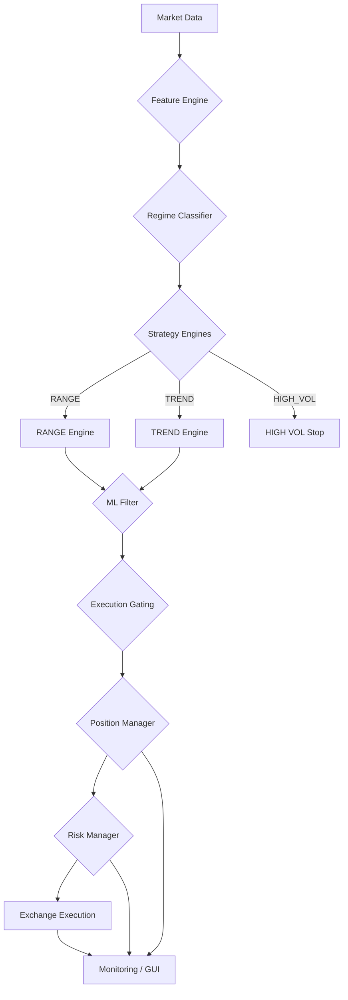

# ARCHITECTURE.md

# Crypto FX Trading System - アーキテクチャ概要

## 全体アーキテクチャ

本システムは「市場構造認識 + リスク管理システム」として設計されており、価格予測AIではありません。以下のモジュラー構造に従い、各フェーズが明確に分離されています。

## ディレクトリとレイヤーの責任

*   **`config/`**: 環境固有の設定を管理。システム設定、取引所設定、リスク設定、ランタイム設定、実行設定、戦略設定、ロギング設定、ワーカー設定を定義。
*   **`docs/`**: ADR、Spec、実装チェックリストなどのプロジェクトドキュメント。開発の意思決定と実装の詳細を記録。
*   **`scripts/`**: 自動化された運用タスク（データパイプライン、バックテスト、検証、ヘルスチェック）。
*   **`src/auto_trader/`**: Pythonアプリケーションのコアロジック。
    *   **`data/`**: OHLCVデータの取得、品質管理、永続化（Parquet）。
    *   **`features/`**: OHLCVデータからテクニカル指標を計算し、特徴量を生成。
    *   **`regime/`**: 市場レジーム（RANGE, TREND, HIGH_VOL）を分類し、その状態を管理。
    *   **`labels/`**: MLモデル学習用のTP/SL二値ラベルを生成し、リークがないことを検証。
    *   **`ml/`**: LightGBMを用いた機械学習モデルの訓練、閾値最適化、シグナルフィルタリング。
    *   **`strategy/`**: RANGEとTRENDの各レジームに特化した取引シグナルを生成。
    *   **`backtest/`**: 過去データに基づく戦略のシミュレーションとパフォーマンス評価。
    *   **`execution/`**: 注文のライフサイクル管理、約定イベントのリコンサイル、フィル追跡。
    *   **`exchange/`**: Binance APIとのインターフェース、注文送信、アカウント情報取得、WebSocketストリーム処理。
    *   **`position/`**: 現在のポジション状態を追跡・管理、平均エントリー価格、ピラミッド管理、エクスポージャー計算。
    *   **`risk/`**: ポートフォリオおよびシンボルレベルでのリスク制限（DD、エクスポージャー、相関リスク）を強制。
    *   **`runtime/`**: システムの全体的な実行フローを制御、GUIからの操作イベントを処理。
    *   **`worker/`**: ライブトレーディングの実行を担当し、市場データ取得、シグナル評価、注文実行、ポジション・リスク管理を統合。
    *   **`monitor/`**: システムのランタイムメトリクスを収集し、ヘルスチェックとパフォーマンス監視を提供。
    *   **`notify/`**: 運用アラートを様々なチャネル（Slack, Webhook, Email）に送信。
    *   **`gui/`**: Streamlitベースのユーザーインターフェース。リアルタイムダッシュボード、コントロール、チャート、分析機能を提供。
    *   **`analysis/`**: 戦略の品質評価、シンボル候補の選定、再検証レポート生成、ウォークフォワード分析。
*   **`tests/`**: 各モジュールの単体テスト、統合テスト、シミュレーションテスト、ストレステスト。

## 依存関係フロー

データは `data` -> `features` -> `regime` -> `labels` -> `ml` -> `strategy` の順に処理され、戦略シグナルが生成されます。これらのシグナルは `worker` を通じて `exchange` へ渡され、`execution` と `position` が管理します。`risk` は常に全体の健全性を監視し、`monitor` と `notify` が運用者にフィードバックを提供します。`gui` はこれらのすべての情報を可視化し、ユーザー操作を `runtime` に伝達します。

## 設計原則

1.  **Regime First**: 市場構造（RANGE, TREND, HIGH_VOL）の分類を取引判断の最上位に置く。
2.  **Risk First**: 資本保全とドローダウン制御を最優先し、利益追求よりも生存可能性を重視。
3.  **Execution Safety First**: 注文の冪等性、堅牢なエラー処理、再試行メカニズムを確保し、取引所側の不確実性に対応。
4.  **Observability First**: すべての主要なシステム判断と状態をログに記録し、リアルタイムで監視可能にする。
5.  **Modularity**: 各コンポーネントの責任を明確に分離し、独立した開発とテストを容易にする。
6.  **Type Safety**: `mypy`による厳密な型チェックを導入し、コードの信頼性と保守性を向上。
7.  **Immutability**: 可能な限り不変データ構造を採用し、副作用を最小限に抑える。
8.  **Documentation-First**: コード変更前に設計文書（ADR, Spec）を更新し、設計と実装の一貫性を保つ。
9.  **Incremental Deployment**: DryRun -> Testnet -> Production の段階的なデプロイプロセスを通じて、リスクを最小化しながら変更を導入。

## パターン

*   **Command-Query Responsibility Segregation (CQRS)**: 状態変更（コマンド）と状態参照（クエリ）の分離。例: `PositionManager` はポジション変更を担当し、`GUI` はその状態を表示する。
*   **Publisher-Subscriber**: イベント駆動型アーキテクチャの採用。例: 取引所からのリアルタイムイベント（`user_stream`）をサブスクライブし、複数のコンポーネントが処理する。
*   **Feature Store**: 特徴量の計算結果をキャッシュし、再利用することで効率化 (`FeatureParquetStore`)。
*   **Atomic Write with Recovery**: 重要な状態ファイル（`positions.parquet`, `gateway_state.json` など）の書き込み時に、アトミックな操作とバックアップからの回復メカニズムを保証。

## アンチパターン

*   **God Object**: 単一のオブジェクトが過度な責任を持つことを避ける。各モジュールが専門的な役割を持つように設計。
*   **Magic Numbers/Strings**: 設定ファイルや定数として定義し、コード内にハードコーディングしない。
*   **Premature Optimization**: 最適化は必要な場合にのみ行い、可読性と保守性を優先する。
*   **Future Leakage**: MLモデルの訓練において、未来の情報を誤って使用するリークを厳しく禁止。

## 将来のスケーラビリティ

*   **水平スケーリング**: `worker` を複数インスタンスで実行し、異なるシンボルや戦略を並列で処理できるように設計。`multiprocessing`, `asyncio` を活用。
*   **データストアの拡張**: 現在のParquetベースのデータストアは大規模データに適していますが、必要に応じて分散ストレージ（S3など）や時系列データベースへの移行も可能。
*   **プラグインアーキテクチャ**: 新しい取引所や戦略、特徴量、MLモデルの追加が容易なプラグイン可能なインターフェースを検討。
*   **クラウドネイティブ対応**: Kubernetesなどのコンテナオーケストレーションシステムへのデプロイを考慮し、マイクロサービス化やサーバーレス機能への移行パスを確保。
